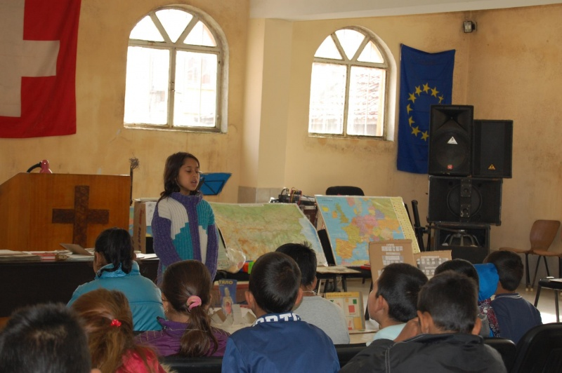
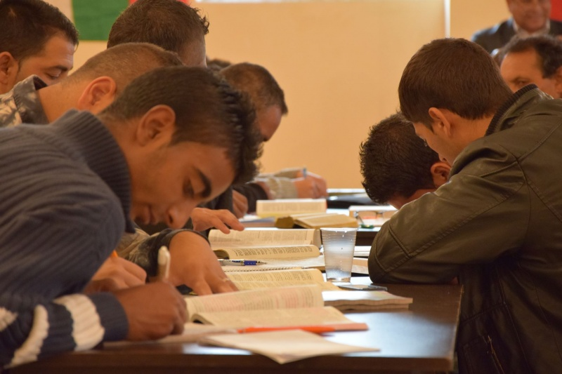

# На гости в гетото или изкуството да бъдеш циганин

|автор | редактор|
|-|-|
|Любомира Вълчева|Райчо Николов|

Оригиналната статия е взета от [тук](http://shushulko.blog.bg/politika/2013/12/09/na-gosti-v-getoto-ili-izkustvoto-da-bydesh-ciganin-p-p.1216855)

Един от най-големите ромски квартали в България се намира в Сливен. Носи звучното име Надежда. Изненадах се като научих, че там се помещават около 18 Евангелски църкви.

За първи път влизам в ромски квартал.

Донякъде очакванията ми се сбъдват – тесни улички, осеяни с дупки, полуголи деца тичат пред колите, полусрутени и полуобитаеми къщи, а до тях триетажни „дворци“; отвсякъде приижда народ, отвсякъде бумти музика.

Все пак, по уличките срещам повече коли, отколкото коне. Простряни дрехи пред къщата „на двора“. Някои къщи са недовършени. Някои чешми са навън.

Карам с един километър в час с ужасяващата мисъл, че мога да блъсна някое дете или че няма да успея да се размина с колата насреща. Разбира се, знаци няма. Запътили сме се към най-голямата църква в махалата. Наблизо някакъв старец седнал на земята, просяк може би, отгатва нашата дестинация, сключва ръце като за молитва и сочи направо и наляво. Упътва ни.

С негова помощ пристигаме на мястото. Отдалеч се чуват евангелски песни на български език. Паркирам колата внимателно, близо до полусрутена стена, вляво от улицата. Вадя радиото, заключвам колата и я поглеждам... Кой знае, може би за последно? 

**В църквата**

Влизаме вътре. Едноетажна зала с желязна конструкция около 100-150 квадрата и печка с кюнец. Залата е пълна с хора. Има и много правостоящи. Посрещат ни още от вратата като скъпи гости. Изглежда има служители, които специално са определени да посрещат и настаняват хората. Настаняват ни най-отпред, на една от масивните дървени пейки, точно до тонколоните. Няколко усмихнати жени се отместват да ни направят място.

– Взе ли радиото от колата? – провиква се мъжа ми, а викът му се губи някъде между гърмящите високоговорители до нас.  
– Да, ще ни остане за спомен... :\ – усмихвам се глуповато.

Гледам хористите, облечени в червени, малко овехтели роби и се чудя къде съм виждала такава неподправена радост. Чудя се как ли живеят тези хора, имат ли какво да ядат, имат ли с какво да облекат децата си. Спомням си всички църковни хорчета, които съм виждала. Не, тези са най-лъчезарните. Пеят чудесно, поклащат се наляво-надясно в такт с музиката, пляскат... До тях музикант трето поколение (по-късно разбирам, че е джазмен) свири на професионален синтезатор. До него брат му приглася с цигулка, а отзад някой бие тарамбуки. Невероятен синхрон.

Най-хубаво става когато започват да пеят на цигански. Залата оживява още повече. В този език има нещо топло, жизнено и емоционално. Напомня леко испанския. Някои песни започват на цигански и завършват на български. Поглеждам скришом назад. Виждам човек в инвалидна количка, жена с гипсиран крак, старци, старици, майки с деца на ръце, наконтени млади момчета. Напук на всички очаквания семействата имат по едно-две деца. Наоколо цари празничен дух. Тези, които имат празнични дрехи са ги облекли за случая. Останалите са си взели празничното настроение.

След службата се разпъват дълги маси и ние веднага сме настанени на най-доброто място като най-скъпи гости. Поднасят ни кюфтета, кебапчета, пържени картофки, сладки, ядки и газирани напитки. Чувстваме се като царе. Жените се суетят и прислужват около нас. Аз се оглеждам смутено наоколо. Веднага някой дотичва до мен:  

– Искате ли кафе?

Седим на една маса с пастора на църквата и неговите най-близки помощници. Всички те учат в презвитерианската семинария в София. Мъжът ми преподава там, сигурно затова на нас се гледа като на почетни гости.

**Училището**

Научавам че всяка неделя след църква има трапеза, а каквото остане отива за най-бедните в региона. Сега забелязвам че в дъното на залата има натъпкани един върху друг чинове, карта на България изписана отгоре до долу с държави и континенти черна дъска. Обясняват ми, че през седмицата организират училище за децата от махалата. Училището се посещава от 80 деца на две смени. Тези, които са първа смяна на държавното училище идват втора смяна в църковното и обратно, тези, които са втора смяна идват тук първа смяна. Родителите им не ходят на църква. Децата пишат на тетрадки, сглобени от картонени изрезки. Но затова пък си имат учител, на заплата от църквата. И не само, че църквата учи и наглежда децата, ами и ги храни.

**Изхвърлям всички обобщения и категории от ума си.**

Освен това научавам, че много хора са се отказали от тъмните си дела и са започнали почтен бизнес. В църквата ги насърчават да сключват брак, младите да се отделят от родителите си и да не живеят на държавни помощи. Църквата помага на някои хора да започнат малък семеен бизнес.

Колкото повече научавам, толкова повече расте моето удивление. Представете си четиредесет деца на различни възрасти седят кротко на чиновете в църквата. Изсред тях се изправя малко дългокосо ангелче и започва да цитира „Отче наш“. Всички деца шумно се включват. След това преговарят континентите и държавите. Сигурна съм че Мартин Карбовски няма да дойде да заснеме това. Ето защо си обещавам да го заснема и да го разкажа.

Излизаме навън. Някак не съм изненадана, че колата ни е непокътната. Пред нас тръгва друга кола, която да ни покаже пътя и да ни изведе от махалата. Този път минаваме по „околовръстното“ шосе. Отляво са къщите на лихварите – високи и хубави. Отдясно има дебела, сива, бетонна стена, висока около два метра и половина. Останалата част от града не се вижда. Стената закрива гледката през целия път. Търкам очи и не мога да повярвам. Все едно съм във филм за Хитлерова Германия. Липсва само звездата на Давид.

Източник на изображението: Авторката

**Ново посещение**

След време посетих къщата на пастора. Състоеше се от две стаи – в едната живееше синът му с жена си и двете си деца, в другата пастора и неговата съпруга. В тяхната стая имаше легло, диван, маса, гардероб и кухненски кът. От стаята се излиза към малко коридорче, което гледа към улицата. То е превърнато в магазинче. Правят кафе, чай и сандвичи. Работата започва в 5 сутринта. Гощават ни с най-вкусните пържоли, които сме яли. Децата се държат възпитано и към тях се отнасят с любов. Оставам в къщата около два часа. За това време вътре влизат и излизат около 20 човека, просто ей така – да поседнат и да си поговорят. Всички са много любезни и усмихнати. Оставам с впечатлението, че къщата на пастора е като хан – всеки влиза и излиза когато си поиска. Вратите разбира се не се заключват.

От първото ми посещение в гетото са минали две години. Махалата видимо не се е променила, но залата на църквата е съборена. На нейно място вярващите са построили по-голяма сграда на два етажа. Старата зала не побирала всички хора и била твърде малка за училището. Дървените пейки са заменени с нови столове, повечето все още са опаковани в найлон. Явно им е жал да го късат.

Сещам се за един пътуващ проповедник който познавах някога. По професия беше ядрен физик и работеше в ХМС Младост 1\. Нисък и сух, посивял, много слаб, с брада и дълга коса. Като току-що изкочил от Стария завет. Та той често обичаше да казва: „Аз много искам да се науча да стана циганин“. Това възклицание беше наистина изненадващо и предизвикваше въпроси. Затова той неизменно започваше да разказва как като попадне в някое село или махала винаги първият въпрос, който му задавали бил „Брате, имаш ли къде да останеш? Гладен ли си?“ След което го канели на вечеря, настанявали го в къщите си на леглото (често единственото в къщата), а домакините спяли на земята. Говореше за тяхната всеотдайност, гостоприемност, детска наивност и чиста вяра. Започвам да разбирам какво е имал предвид.

Разделението и омразата не са решение на сериозните проблеми в тази държава. Те са по-скоро симптом на изместена и объркана ценностна система. Те са удобни само за управниците, които се опитваме да свалим, както и за тези преди тях. Всички ние сме хора, но не на всички нас ни е даден равен шанс. Не всички сме отраснали в хубав квартал, в добро семейство, в топло и удобно жилище, не всички сме били учени и наставлявани от малки. Църквата в Сливен доказва, че никога не е късно да възпиташ човека в правилните ценности. 

Затова приемането е добро начало. А най-лесният начин да приемем различните хора, е като ги опознаем. Кой знае, току-виж сме научили нещо ценно от тях!

**Колко е малък светът**

Две години по-късно пасторът на ромската църква ми беше на гости. На вратата се заговорихме с него и тогава му споделих за моят познат, пътуващият проповедник и неговата крилата фраза „искам да се науча да стана циганин“. За мое пълно изумление се оказа, че същият този човек е посещавал църквата в Сливен всяка година и е отсядал у пастора - тогава, _когато цялото семейство е живеело в една стая_.   

Все още не мога да повярвам колко е малък светът!

